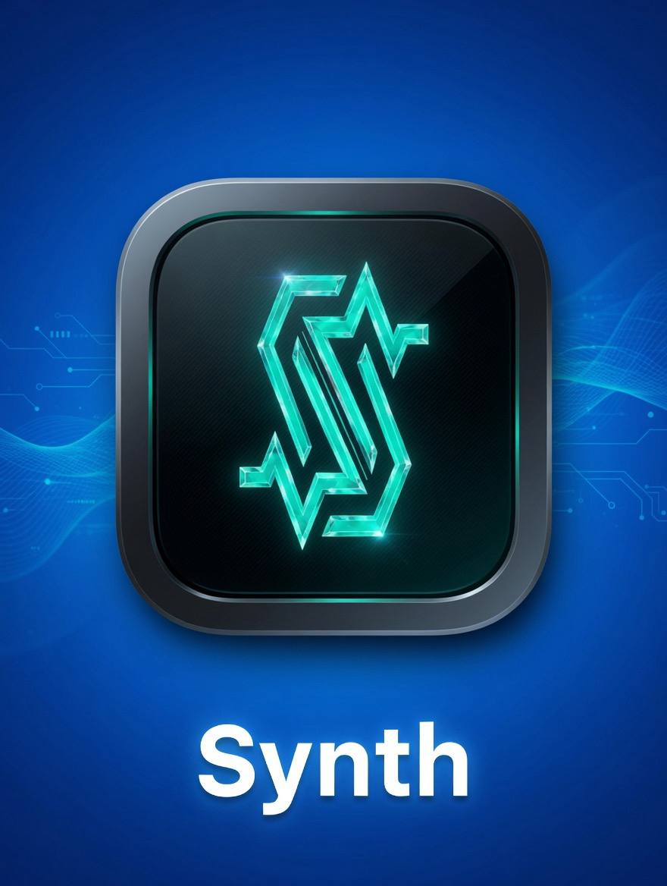
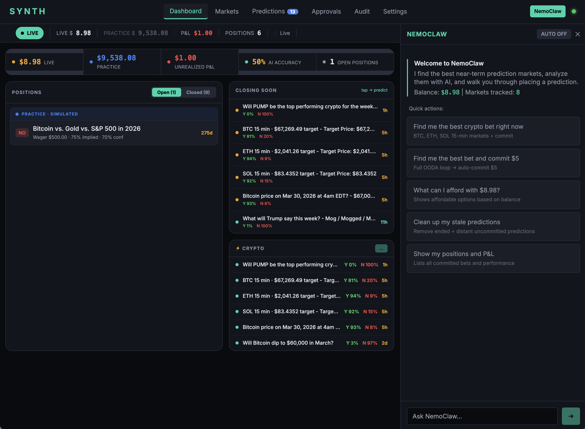
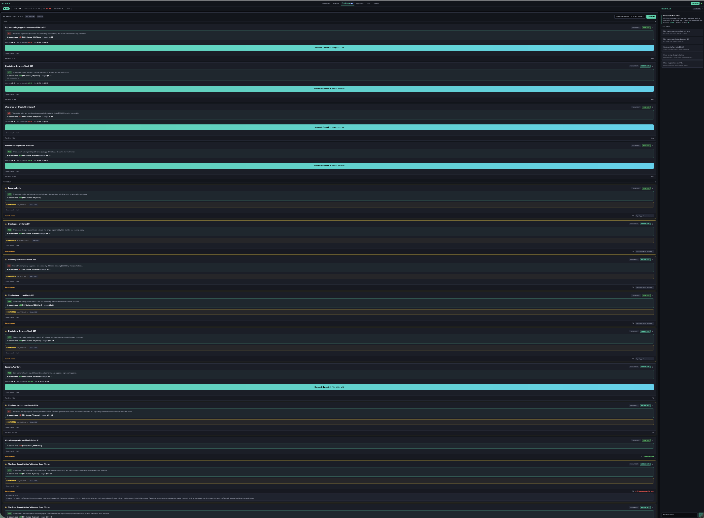
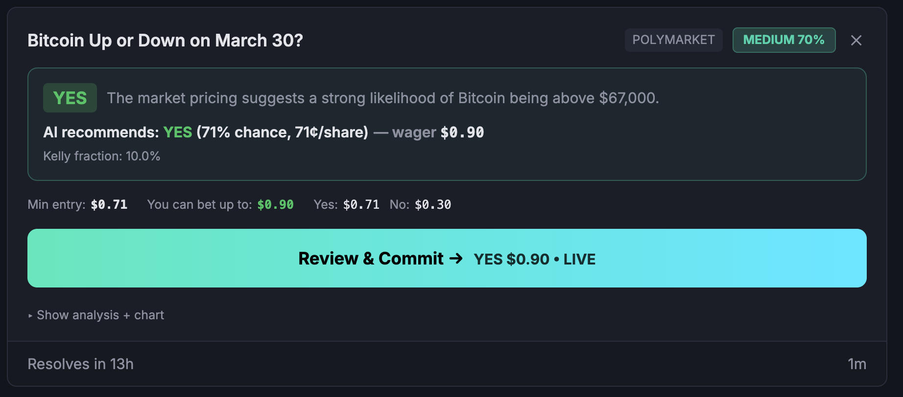
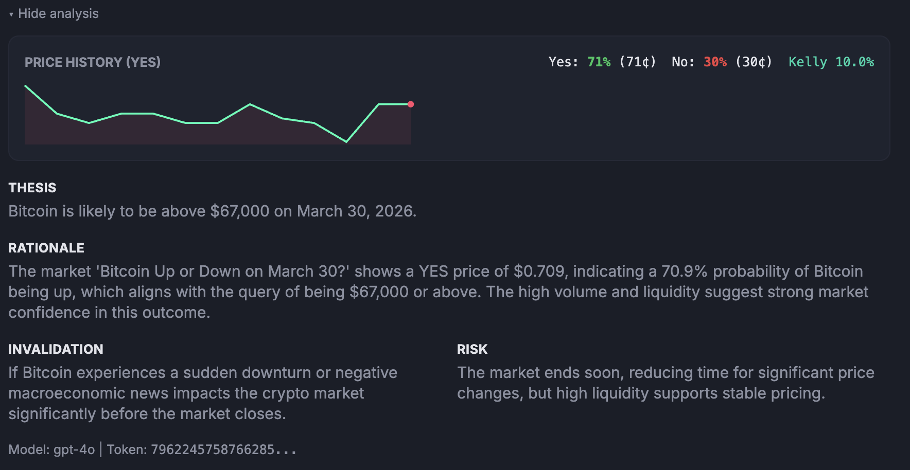
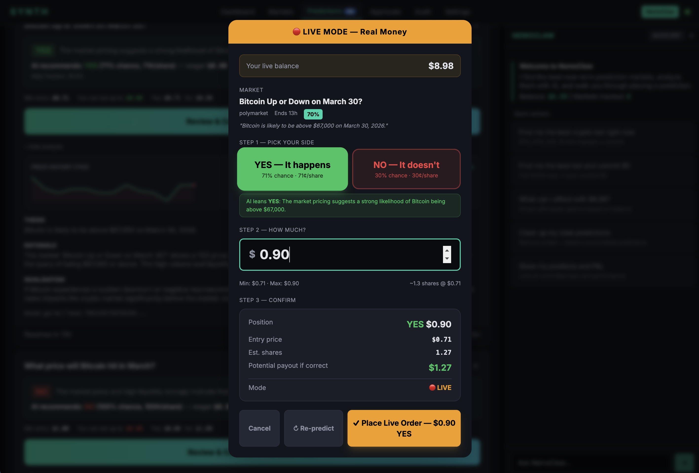
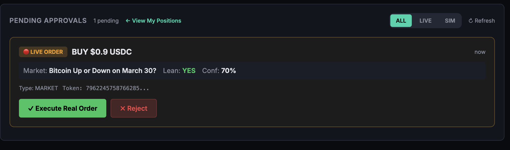

<p align="center">
  
</p>

<h1 align="center">Synth</h1>
<p align="center">AI-assisted prediction market desk. Connects to Polymarket and Kalshi via the synthesis.trade API, with GPT-4o generating structured predictions and Kelly-optimal position sizing.</p>

---

## Launch

```bash
cd app && npm install && npm start
```

The dashboard opens at [http://127.0.0.1:8420](http://127.0.0.1:8420).

---

## Interface Flow

Synth follows a five-step loop: **Discover → Analyze → Decide → Place → Approve**.

### 1. Dashboard

<p align="center">
  
</p>

The Dashboard is the home screen. It shows three panels:

- **Left — Positions**: Your open and closed bets. Toggle between `Open` and `Closed` to review active wagers vs. settled results. Each card shows the market name, wager size, implied probability, confidence, and days until resolution.
- **Center — Closing Soon / Crypto**: Markets about to resolve, sorted by time remaining. Each row shows the market question, the current YES/NO probability split, and time left. Tap any row to generate a prediction.
- **Right — NemoClaw Agent**: The AI assistant panel. Use the quick-action buttons to find the best crypto bet, commit a specific dollar amount, view affordable options, clean up stale predictions, or show your P&L. You can also type free-form questions.

**Key buttons:**
- The top nav bar has tabs for **Dashboard**, **Markets**, **Predictions**, **Approvals**, **Audit**, and **Settings**.
- The wallet strip below the nav shows your **LIVE** and **PRACTICE** balances plus **P&L**, **AI Accuracy**, and **Open Positions** count.
- Click the **Live / Sim** toggle to switch between real-money and practice modes.

---

### 2. Predictions Tab

<p align="center">
  
</p>

Click **Predictions** in the top nav. This screen lists every prediction the AI has generated, organized by recency. Each card contains:

- The prediction question and AI's directional lean (YES/NO).
- Confidence level, Kelly fraction, and recommended wager.
- A progress bar showing the market's current YES/NO pricing.
- Status badges: `GENERATED` (awaiting your review), `COMMITTED` (order placed), or `RESOLVED` (market settled).

Cards are color-coded: cyan bars indicate active markets with time remaining, orange bars indicate markets nearing expiry. Use the right-side **Selection Analytics** panel to batch-review, see aggregate stats, or filter by status.

---

### 3. Single Prediction — Review & Commit

<p align="center">
  
</p>

Tap any market row or prediction card to open the prediction detail view:

- **Header**: Market name, source venue (Polymarket/Kalshi), and confidence badge (LOW / MEDIUM / HIGH).
- **AI Recommendation**: The lean direction (YES or NO), the probability estimate, the share price, and the suggested wager amount.
- **Kelly fraction**: How much of your bankroll the Kelly criterion recommends risking.
- **Min entry / Max affordable / Yes price / No price**: Key numbers to size your bet.
- **Review & Commit button**: Opens the order placement flow. Shows the lean direction, dollar amount, and current mode (LIVE or PRACTICE).
- **Show analysis + chart**: Expands the analysis panel (see next step).

---

### 4. Analysis

<p align="center">
  
</p>

Click **Show analysis + chart** on any prediction to reveal the full AI analysis:

- **Price History chart**: A line chart of the YES token price over time. The red dot marks the current price. Use this to spot trends, momentum, and entry timing.
- **Yes / No / Kelly stats**: Current share prices with percentage probabilities and the Kelly fraction.
- **Thesis**: A 1–2 sentence directional call — what the AI believes will happen and why.
- **Rationale**: 2–3 sentences grounding the view in market data, volume, liquidity, and news context.
- **Invalidation**: What scenario would make this prediction wrong. Useful for setting mental stop-losses.
- **Risk**: Liquidity, expiry, or volatility risks the AI has identified.
- **Model + Token**: Which GPT model generated the analysis and the on-chain token identifier.

**Strategies reflected in the analysis:**

| Strategy | How It's Used |
|----------|---------------|
| **Market Scoring** | Markets ranked by urgency (40%), liquidity (20%), volume (20%), and price dislocation (20%). Near-term markets surface first. |
| **Kelly Criterion Sizing** | Three variants — binary market Kelly, classical Kelly, and drawdown-adjusted Kelly — determine optimal bet size relative to bankroll. |
| **Confidence-Gated Entry** | Only markets above the confidence threshold (default 0.55) get trade suggestions. Below-threshold markets receive HOLD recommendations. |
| **Price Dislocation Detection** | Markets priced far from 50/50 get flagged. The further the dislocation, the higher the score — indicating potential mispricing. |
| **Time-Weighted Urgency** | Log-scaled urgency scoring prioritizes markets resolving within hours over those weeks away. |
| **Risk Capping** | Max 10% of wallet per prediction, 50% total utilization, per-trade and daily loss limits prevent catastrophic drawdowns. |

---

### 5. Place Order — Commit Flow (LIVE Mode)

<p align="center">
  
</p>

After reviewing a prediction, click **Review & Commit** to open the order modal. In **LIVE MODE** (real money), the flow has three steps:

**Step 1 — Pick Your Side**
Choose **YES — It happens** or **NO — It doesn't**. The AI's recommended lean is highlighted. Each button shows the implied probability and share price.

**Step 2 — How Much?**
Enter a dollar amount. The modal shows:
- Min and Max based on your balance and risk limits.
- Estimated shares at the current price.
- Quick-amount buttons ($1, $5, $10, etc.) filtered to your affordable range.

**Step 3 — Confirm**
Review the summary: position direction, entry price, estimated shares, potential payout if correct, and the current mode (LIVE or PRACTICE).

**Bottom buttons:**
- **Cancel**: Close without placing.
- **Re-predict**: Run the AI analysis again with fresh market data.
- **Place Live Order**: Submit the order. In LIVE mode with approval enabled, this queues the order to the Approvals tab. In SIM mode, it executes immediately as a practice bet.

> **SIM MODE**: All the same steps apply, but the header shows "PRACTICE MODE" instead of "LIVE MODE", amounts come from your practice balance, and orders execute instantly without approval.

---

### 6. Pending Approvals Queue

<p align="center">
  
</p>

When you place a LIVE order, it lands in the **Approvals** tab (accessible from the top nav). This is the human-in-the-loop safety gate.

Each pending approval card shows:
- **LIVE ORDER** badge and the dollar amount.
- The market question, your lean (YES/NO), and the confidence level.
- Order type (MARKET) and the on-chain token ID.

**Two action buttons:**
- **Execute Real Order** (green): Sends the order to the exchange via the synthesis.trade API. This uses real USDC from your wallet. Once executed, the prediction status updates to `COMMITTED` and appears in your Positions.
- **Reject** (red): Cancels the pending order. The prediction remains in your list as `GENERATED` so you can re-evaluate later.

Use the **ALL / LIVE / SIM** filter tabs to narrow the view. Click **Refresh** to check for new pending items.

---

## Setup

```bash
git clone https://github.com/DylanCkawalec/synth.git && cd synth

# Configure
cp .env.example .env
# Edit .env with your keys from https://synthesis.trade/dashboard

# Install and run
cd app && npm install && npm start
```

### Environment Variables

| Variable | Required | Description |
|----------|----------|-------------|
| `SECRET_KEY_SYNTH` | Yes | synthesis.trade API secret key |
| `PUBLIC_KEY_SYNTH` | Yes | synthesis.trade API public key |
| `OPENAI_API_KEY` | For predictions | OpenAI API key for GPT-4o |
| `SIMULATION_MODE` | — | `true` (default) or `false` for live trading |
| `CONFIDENCE_THRESHOLD` | — | Minimum confidence to suggest trades (default: 0.55) |
| `MAX_POSITION_USDC` | — | Maximum position size (default: 1000) |
| `MAX_SINGLE_ORDER_USDC` | — | Maximum single order (default: 100) |
| `MAX_DAILY_LOSS_USDC` | — | Daily loss limit (default: 200) |
| `SERVER_HOST` | — | Bind address (default: `127.0.0.1`; use `0.0.0.0` in Docker) |
| `SERVER_PORT` | — | HTTP port (default: `8420`) |
| `SIM_STARTING_BALANCE` | — | Starting balance for sim wallet (default: `10000`) |
| `COMPACTION_HOUR` | — | Local hour (0–23) to run prediction log compaction |
| `AGGREGATION_INTERVAL_HOURS` | — | Hours between summary aggregation runs |

---

## Architecture

```
┌─────────────────────────────────────────────┐
│         React + TypeScript + Tailwind        │
│  Dashboard · Markets · Predictions · Wallet   │
│  Deposit · Withdraw · MetaMask · QR Codes    │
└──────────────────┬──────────────────────────┘
                   │
┌──────────────────▼──────────────────────────┐
│           Express Server (Node.js)           │
│  API proxy · GPT-4o engine · SQLite store    │
├──────────────────────────────────────────────┤
│         synthesis.trade API                   │
│  Markets · Wallets · Orders · Deposits       │
└──────────────────────────────────────────────┘
```

**Core files:**

```
app/
├── server/index.ts       Express server (API proxy, predictions, persistence)
├── server/db.ts          SQLite database layer
├── server/kelly.ts       Kelly criterion calculations
├── server/simWallet.ts   Simulation wallet logic
├── server/memory.ts      Aggregation and compaction workers
├── src/App.tsx           React dashboard
├── src/api.ts            API client
├── src/scoring.ts        Market scoring engine
├── src/types.ts          TypeScript definitions
└── src/index.css         Tailwind + custom properties
```

---

## Scoring Model

Markets ranked by weighted composite score:

| Signal | Weight | Description |
|--------|--------|-------------|
| **Urgency** | 40% | Time to market resolution (log-scaled, near-term preferred) |
| **Liquidity** | 20% | Orderbook depth |
| **Volume** | 20% | 24-hour trading volume |
| **Dislocation** | 20% | Distance from 50/50 pricing |

---

## Risk Controls

| Control | Default | Purpose |
|---------|---------|---------|
| Max per prediction | 10% of wallet | Prevent single-bet ruin |
| Max total utilization | 50% of wallet | Preserve dry powder |
| Max single order | $100 USDC | Limit per-trade exposure |
| Max daily loss | $200 USDC | Drawdown circuit breaker |
| Confidence threshold | 0.55 | Block low-conviction trades |
| Approval gate | On | Human review required |

---

## Theme System

Dual-theme system for visual mode distinction:

- **Live mode**: Dark theme (deep navy/black, green accents)
- **Simulation mode**: Light theme (white/gray, green accents)

The mode toggle in the wallet strip switches between LIVE and SIMULATION.

---

## Wallet Operations

Settings provides four tabs: **Wallet**, **Deposit**, **Withdraw**, **Config**.

### Deposit
- Select token (USDC, USDC.e, USDT) and network (Polygon, Ethereum, Solana, Base, Binance, Arbitrum, Optimism)
- Deposit address auto-fetched from synthesis.trade API
- Copy button and QR code
- MetaMask detection with chain-aware guidance

### Withdraw
- Select token and network
- Amount field with MAX button
- Default to connected MetaMask address, or custom address
- EVM and Solana address validation
- Network mismatch warnings

### MetaMask Integration
- One-click MetaMask connection
- Auto-detect chain, address, and ETH balance
- Listen for account and chain changes
- Chain mismatch warnings

---

## Agent Integration

NemoClaw MCP server exposes agent tools:

- `fetch_markets` — Search and score prediction markets
- `fetch_balance` — Get wallet balance across chains
- `fetch_positions` — Get open positions
- `generate_prediction` — Run AI prediction on a market
- `get_price_history` — Analyze token price trends
- `get_market_stats` — Volume, liquidity, and open interest
- `research_topic` — Fetch news and context for fundamental research
- `place_order` — Place market or limit orders
- `list_predictions` — Review predictions with accuracy stats
- `clean_stale_predictions` — Remove ended/distant uncommitted predictions

---

## Documentation

- [Whitepaper](docs/whitepaper.md) — Protocol overview
- [Getting Started](docs/guides/getting-started.md) — Account setup and first order
- [Authentication](docs/guides/authentication.md) — API authentication methods
- [WebSockets](docs/guides/websockets.md) — Real-time data streaming
- [API Reference](docs/api/reference.md) — Complete API documentation
- [Ensemble Architecture](docs/prd-ensemble-architecture.md) — Calibrated swarm ensemble design

---

## License

MIT
