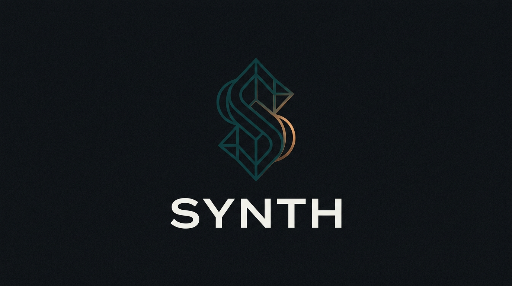

<p align="center"></p>

# Synth

AI-assisted prediction market desk. Connects to Polymarket and Kalshi via synthesis.trade API, with GPT-4o generating structured predictions and Kelly-optimal position sizing.

---

## Launch

**From terminal:**

```bash
cd app && npm install && npm start
```

The dashboard opens at [http://127.0.0.1:8420](http://127.0.0.1:8420).

---

## How It Works

```
Discover → Analyze → Decide → Track
```

1. **Discover** — Markets scored by urgency, liquidity, volume, and price dislocation. Near-term markets surface first.
2. **Analyze** — GPT-4o generates thesis, confidence (0-1), rationale, risk notes, and Kelly-sized execution.
3. **Decide** — Review the prediction card. Approve or skip. Simulation mode by default.
4. **Track** — Predictions persisted with full provenance. Mark correct/incorrect post-resolution to measure AI accuracy.

---

## Setup

```bash
git clone https://github.com/DylanCkawalec/synth.git && cd synth

# Configure
cp .env.example .env
# Edit .env with your keys from https://synthesis.trade/dashboard

# Install and run
cd app && npm install && npm start
```

### Environment Variables

| Variable | Required | Description |
|----------|----------|-------------|
| `SECRET_KEY_SYNTH` | Yes | synthesis.trade API secret key |
| `PUBLIC_KEY_SYNTH` | Yes | synthesis.trade API public key |
| `OPENAI_API_KEY` | For predictions | OpenAI API key for GPT-4o |
| `SIMULATION_MODE` | — | `true` (default) or `false` for live trading |
| `CONFIDENCE_THRESHOLD` | — | Minimum confidence to suggest trades (default: 0.55) |
| `MAX_POSITION_USDC` | — | Maximum position size (default: 1000) |
| `MAX_SINGLE_ORDER_USDC` | — | Maximum single order (default: 100) |
| `MAX_DAILY_LOSS_USDC` | — | Daily loss limit (default: 200) |
| `SERVER_HOST` | — | Bind address (default: `127.0.0.1`; use `0.0.0.0` in Docker) |
| `SERVER_PORT` | — | HTTP port (default: `8420`) |
| `SIM_STARTING_BALANCE` | — | Starting balance for sim wallet (default: `10000`) |
| `COMPACTION_HOUR` | — | Local hour (0–23) to run prediction log compaction |
| `AGGREGATION_INTERVAL_HOURS` | — | Hours between summary aggregation runs |

---

## Architecture

```
┌─────────────────────────────────────────────┐
│         React + TypeScript + Tailwind        │
│  Dashboard · Markets · Predictions · Wallet   │
│  Deposit · Withdraw · MetaMask · QR Codes    │
└──────────────────┬──────────────────────────┘
                   │
┌──────────────────▼──────────────────────────┐
│           Express Server (Node.js)           │
│  API proxy · GPT-4o engine · SQLite store    │
├──────────────────────────────────────────────┤
│         synthesis.trade API                   │
│  Markets · Wallets · Orders · Deposits       │
└──────────────────────────────────────────────┘
```

**Core files:**

```
app/
├── server/index.ts       Express server (API proxy, predictions, persistence)
├── server/db.ts          SQLite database layer
├── server/kelly.ts       Kelly criterion calculations
├── server/simWallet.ts   Simulation wallet logic
├── server/memory.ts      Aggregation and compaction workers
├── src/App.tsx           React dashboard
├── src/api.ts            API client
├── src/scoring.ts        Market scoring engine
├── src/types.ts          TypeScript definitions
└── src/index.css         Tailwind + custom properties
```

---

## Theme System

Dual-theme system for visual mode distinction:

- **Live mode**: Dark theme (deep navy/black, green accents)
- **Simulation mode**: Light theme (white/gray, green accents)

The mode toggle in the wallet strip switches between LIVE and SIMULATION.

---

## Wallet Operations

Settings provides four tabs: **Wallet**, **Deposit**, **Withdraw**, **Config**.

### Deposit
- Select token (USDC, USDC.e, USDT) and network (Polygon, Ethereum, Solana, Base, Binance, Arbitrum, Optimism)
- Deposit address auto-fetched from synthesis.trade API
- Copy button and QR code
- MetaMask detection with chain-aware guidance

### Withdraw
- Select token and network
- Amount field with MAX button
- Default to connected MetaMask address, or custom address
- EVM and Solana address validation
- Network mismatch warnings

### MetaMask Integration
- One-click MetaMask connection
- Auto-detect chain, address, and ETH balance
- Listen for account and chain changes
- Chain mismatch warnings

---

## Scoring Model

Markets ranked by weighted composite score:

| Signal | Weight | Description |
|--------|--------|-------------|
| **Urgency** | 40% | Time to market resolution (log-scaled, near-term preferred) |
| **Liquidity** | 20% | Orderbook depth |
| **Volume** | 20% | 24-hour trading volume |
| **Dislocation** | 20% | Distance from 50/50 pricing |

---

## Risk Controls

| Control | Default | Purpose |
|---------|---------|---------|
| Max per prediction | 10% of wallet | Prevent single-bet ruin |
| Max total utilization | 50% of wallet | Preserve dry powder |
| Max single order | $100 USDC | Limit per-trade exposure |
| Max daily loss | $200 USDC | Drawdown circuit breaker |
| Confidence threshold | 0.55 | Block low-conviction trades |
| Approval gate | On | Human review required |

---

## Agent Integration

NemoClaw MCP server exposes 8 agent tools:

- `fetch_markets` — Search and score prediction markets
- `fetch_balance` — Get wallet balance across chains
- `fetch_positions` — Get open positions
- `generate_prediction` — Run AI prediction on a market
- `fetch_recommendations` — Get personalized recommendations
- `fetch_news` — Get prediction-market-related news
- `switch_tab` — Navigate dashboard tabs
- `highlight` — Highlight UI elements

---

## Documentation

- [Whitepaper](docs/whitepaper.md) — Protocol overview
- [Getting Started](docs/guides/getting-started.md) — Account setup and first order
- [Authentication](docs/guides/authentication.md) — API authentication methods
- [WebSockets](docs/guides/websockets.md) — Real-time data streaming
- [API Reference](docs/api/reference.md) — Complete API documentation
- [Ensemble Architecture](docs/prd-ensemble-architecture.md) — Calibrated swarm ensemble design

---

## License

MIT
