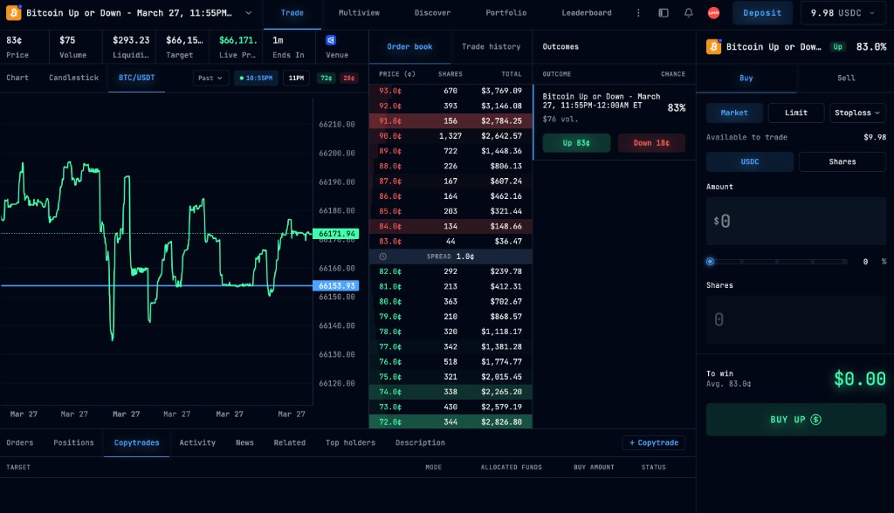
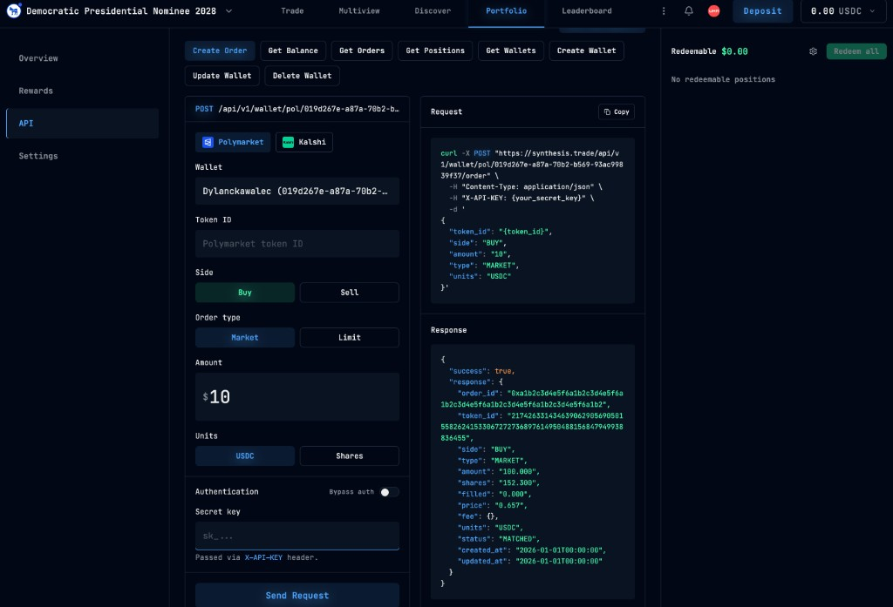
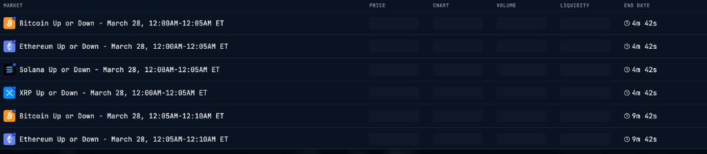

<p align="center"></p>

# Synth

AI prediction desk for near-term markets. One click from discovery to execution.

Built on [synthesis.trade](https://synthesis.trade) — Polymarket + Kalshi, GPT-4o predictions, Nemoclaw MCP agent runtime.

---

## Launch

**Double-click `Synth.command` on your Desktop.** That's it.

Or from terminal:

```bash
cd app && npm start
```

The dashboard opens at [http://127.0.0.1:8420](http://127.0.0.1:8420).

---

## How It Works

```
Discover → Analyze → Decide → Track
```

1. **Discover** — Markets scored by urgency, liquidity, volume, edge. Near-term first.
2. **Analyze** — GPT-4o generates thesis, confidence, rationale, risk, Kelly sizing.
3. **Decide** — Review the card. Approve or skip. Simulation mode by default.
4. **Track** — Every prediction persisted. Mark correct/incorrect. See if AI was right.

---

## Screenshots

### synthesis.trade — Trade View


### synthesis.trade — API Playground


### synthesis.trade — Market Discovery


---

## Setup

```bash
git clone https://github.com/DylanCkawalec/synth.git && cd synth

# Configure
cp .env.example .env
# Add keys from https://synthesis.trade/dashboard

# Install & run
cd app && npm install && npm start
```

### Auto-start on login (macOS)

```bash
./scripts/install-launcher.sh
```

### Environment

| Variable | Required | Default |
|----------|----------|---------|
| `SECRET_KEY_SYNTH` | Yes | — |
| `PUBLIC_KEY_SYNTH` | Yes | — |
| `OPENAI_API_KEY` | For predictions | — |
| `SIMULATION_MODE` | — | `true` |
| `CONFIDENCE_THRESHOLD` | — | `0.55` |
| `MAX_POSITION_USDC` | — | `1000` |
| `MAX_SINGLE_ORDER_USDC` | — | `100` |
| `MAX_DAILY_LOSS_USDC` | — | `200` |

---

## Architecture

```
┌─────────────────────────────────────────────┐
│         React + TypeScript + Tailwind        │
│  Dashboard · Markets · Predictions · Audit   │
└──────────────────┬──────────────────────────┘
                   │
┌──────────────────▼──────────────────────────┐
│           Express Server (Node.js)           │
│  API proxy · GPT-4o engine · JSONL store     │
├──────────────────────────────────────────────┤
│         synthesis.trade API                   │
│  Markets · Wallets · Orders · WebSockets     │
└──────────────────────────────────────────────┘
```

**7 source files.** Server + 5 frontend modules + CSS. No framework bloat.

```
app/
├── server/index.ts      Express server (API proxy, predictions, persistence)
├── src/App.tsx           Complete dashboard (6 tabs)
├── src/api.ts            Typed API client
├── src/scoring.ts        Market scoring engine
├── src/types.ts          TypeScript interfaces
├── src/main.tsx          Entry point
└── src/index.css         Tailwind
```

---

## Scoring

Markets ranked by composite score. Near-term resolution is everything.

| Signal | Weight |
|--------|--------|
| **Urgency** (time to resolution) | 40% |
| **Liquidity** (orderbook depth) | 20% |
| **Volume** (24h momentum) | 20% |
| **Dislocation** (price from 50/50) | 20% |

---

## Safety

- **Simulation mode** on by default
- **10% max** per prediction
- **50% max** total wallet utilization
- **Approval gate** for all executions
- **Confidence threshold** blocks low-conviction trades
- Secrets in `.env` only

---

## Agent Integration

Nemoclaw MCP server exposes 26 tools for AI agents:

```json
{
  "mcpServers": {
    "nemoclaw": {
      "command": "synthesis-mcp",
      "env": { "SECRET_KEY_SYNTH": "...", "OPENAI_API_KEY": "..." }
    }
  }
}
```

READ (14) · PREDICT (2) · EXECUTE (2) · ADMIN (8)

---

## Docs

- [Whitepaper](docs/whitepaper.md)
- [Getting Started](docs/guides/getting-started.md)
- [Authentication](docs/guides/authentication.md)
- [WebSockets](docs/guides/websockets.md)
- [API Reference](docs/api/reference.md)

---

MIT
